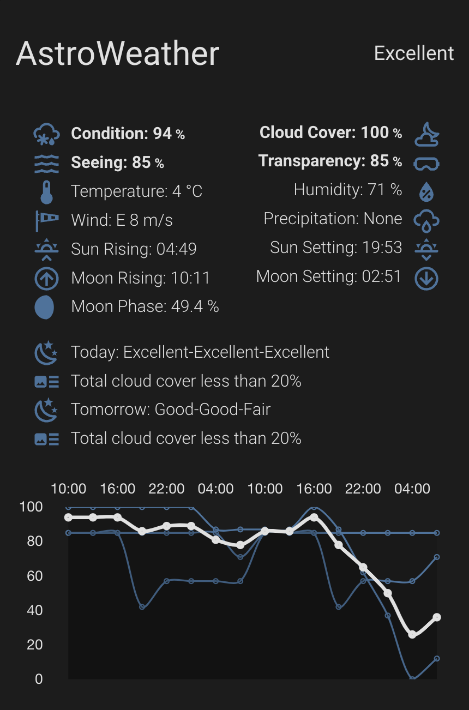

# Lovelace AstroWeather Card


[](https://github.com/custom-components/hacs)

This is a custom weather card for my custom [Home Assistant](https://www.home-assistant.io/) integration [AstroWeather](https://github.com/mawinkler/astroweather).



The percentages that are calculated and graphed are to be read like 100% is perfect, 0% is bad. This also means, that a percentage of e.g. 87% for cloud does stand for a sky being nearly cloud free ;-).

Thanks for all picking this card up.

PS: will redo the screenshot with better conditions...

## Installation

### HACS installation

This Integration is part of the default HACS store, so go to the HACS page and search for *AstroWeather* within the Lovelace category.

### Manual Installation

To add the AstroWeather card to your installation, download the [astroweather-card.js](https://raw.githubusercontent.com/mawinkler/astroweather-card/main/dist/astroweather-card.js) and [astroweather-card-editor.js](https://raw.githubusercontent.com/mawinkler/astroweather-card/main/dist/astroweather-card-editor.js) to `/config/www/custom-lovelace/astroweather-card/`.

Add the card to your dashboard by choosing `[Edit Dashboard]` and then `[Manage Resources]`.

Use `/local/custom-lovelace/astroweather-card/astroweather-card.js` for the URL parameter and set the resource type to `JavaScript Module`.

Alternatively, add the following to resources in your lovelace config:

```yaml
resources:
  - url: /local/custom-lovelace/astroweather-card/astroweather-card.js
    type: module
```

## Configuration

And add a card with type `custom:astroweather-card`:

```yaml
type: custom:astroweather-card
entity: weather.astroweather_backyard
details: true
current: true
deepskydetails: true
forecast: false
graph: true
graph_condition: true
graph_cloudless: true
graph_seeing: false
graph_transparency: false
graph_calm: true
graph_li: false
graph_precip: true
graph_fog: true
number_of_forecasts: "48"
line_color_condition: "#f07178"
line_color_condition_night: "#eeffff"
line_color_cloudless: "#c3e88d"
line_color_seeing: "#ffcb6b"
line_color_transparency: "#82aaff"
line_color_calm: "#ff5370"
line_color_li: "#89ddff"
line_color_precip: "#82aaff"
line_color_fog: "#dde8ff"
```

Optionally, you can define custom tap actions to happen when clicking on the card. Below are some examples:

```yaml
tap_action:
  action: more-info
```

```yaml
# Assumes an input boolean to put your house into stargazer mode
tap_action:
  action: call-service
  service: input_boolean.toggle
  data:
    entity_id: input_boolean.stargazer_mode
```

```yaml
# Assumes you have a view called astroweather
tap_action:
  action: navigate
  navigation_path: /lovelace/astroweather
```

```yaml
# Navigates you to Meteoblue seeing forecast
tap_action:
  action: url
  url_path: https://www.meteoblue.com/en/weather/outdoorsports/seeing
```

```yaml
# Assumes you have UpTonight and browser_mod
tap_action:
  action: fire-dom-event
  browser_mod:
    service: browser_mod.popup
    data:
      title: UpTonight
      size: wide
      content:
        type: picture-entity
        entity: image.uptonight
```

You can choose wich elements of the weather card you want to show:

- The title and current view conditions.
- The details about the current weather.
- The deep sky forecast for today and tomorrow in plain text.
- The hourly forecast for clouds, seeing, transparency, view conditions and temperature.
- The graphical forecast. You can configure which conditions to display and define the line colors. 

If you enable either the forecast or the graph you can define the number of future forecasts in hourly steps. It is best to only choose the forecast table or the graphical forcast since the graphical variant can display 48hs easily which is not possible with the table. You might create a dedicated card for the table view, simply clone the card and enable forecast only.

```yaml
type: custom:astroweather-card
entity: weather.astroweather_LONGITUDE_LATITUDE
name: Backyard
current: false
details: false
deepskydetails: false
forecast: true
graph: false
number_of_forecasts: '8'
```

The card owns a card editor which pops up if you click on `[Edit]` which being in edit mode of your view.

## TS Migration

```sh
npm install --save-dev rollup @rollup/plugin-node-resolve @rollup/plugin-typescript
npm install --save-dev @rollup/plugin-commonjs
npm install --save tslib
npm install custom-card-helpers

npm install
export PATH=$PWD/node_modules/.bin:$PATH

npm run build
```

## Development Instructions

To do development work on this card (either for your personal use, or to contribute via pull requests), follow these steps:

1. Create a fork of this repository on GitHub
2. Download and setup the repository on your local machine, by running:
```
git clone https://github.com/mawinkler/astroweather-card
cd astroweather-card
git remote add upstream https://github.com/mawinkler/astroweather-card
```
3. Once the repository is setup, install the npm dependencies with `npm install`
4. Make local edits as needed to the grocy chores card. 
5. To test changes, run `npm run build`. This will create a compiled version of the card in `dist/astroweather-card.js` and `dist/astroweather-card-editor.js`.
6. Copy the compiled card in the `dist/` folder to your Home Assistant installation and update the dashboard resources to point to it. Make sure the cache is cleared each time you try updating with new changes.
7. Push the changes back to your GitHub origin, and open a pull request if you want to contribute them to the main repository.
